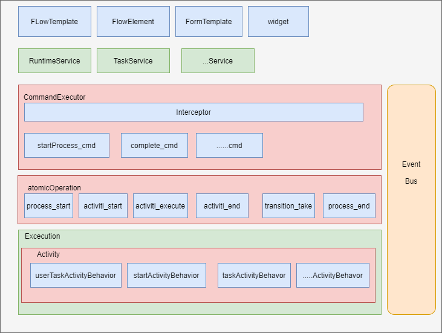

分享文档
======

makeflow流程引擎框架
-------

**作者：** 王峰

**日期：** 2023.10.20
**版本：** 1.0
--

### 什么是工作流?

    工作流（Workflow），是对工作流程及其各**操作**步骤之间业务规则的抽象、概括描述。 工作流建模，即将工作流程中的工作如何前后组织在一起的**逻辑和规则**，在计算机中以恰当的模型表達并对其实施计算。 工作流要解决的主要问题是：为实现某个业务目标，利用计算机在多个参与者之间按某种预定规则自动传递文档、信息或者任务。

    个人按字面理解:

            1、工作？业务、行为、操作

            2、流？ 流动、流转

            3、工作流  ？让业务有组织的去流转运行

            4、怎么流转？ 那么就需要流程引擎来控制流转

### 流程引擎是什么？

引擎这个东西很多？特别是在低代码这块，表单引擎、流程引擎、规则引擎、门户引擎、数据引擎；

**引擎是脱离具体业务场景的某一类业务场景的高度抽象和封装**

流程引擎说白了就是用来驱动业务按照我设定的固定流程去流转的东西，在复杂多变的业务情况下，使用既定的流程能够大大降低我们设计业务的成本，并且保证了我们业务执行的准确性。


 eg1 : 企业常见审批


eg2:网上购物业务


 

### 介绍一下目前已有的开源流程框架

当比较不同的流程引擎框架时，使用表格是一种清晰和有效的方式来展示它们的介绍及优缺点。以下是一个示例表格，用于比较不同流程引擎框架：

| **框架**   | **介绍**                                 | **优点**                                     | **缺点**                                                               |
| -------- | -------------------------------------- | ------------------------------------------ | -------------------------------------------------------------------- |
| Activiti | - 基于BPMN 2.0标准的开源流程引擎。 - 支持流程建模、执行和管理。 | - 易于使用的图形化设计器。 - 大型社区和活跃的开发。 - 丰富的扩展库。     | - 由于历史悠久，比较复杂，代码量30万+。 - 集成到其他框架可能需要一些工作。<br/><br/>-定制化功能可能要去覆盖源码，难看 |
| Camunda  | - 基于Activiti的分支，提供了类似的功能，但更注重开发友好性。    | - 简单易用的API和界面。 - 高度可扩展性和定制性。 - 社区支持。       | - 某些高级功能需要付费版。 - 对于大型流程，可能需要一些性能优化。                                  |
| jBPM     | - 由Red Hat维护的开源流程引擎，支持BPMN 2.0。        | - 与JEE和Spring集成良好。 - 完全的开源解决方案。 - 企业级支持。   | - 学习曲线较陡峭，不太适合初学者。 - 社区相对较小。                                         |
| Flowable | - 基于Activiti的分支，旨在提供更轻量级的解决方案。         | - 高度灵活的引擎。 - 适用于微服务架构。 - 易于集成。             | - 社区相对较小。 - 功能可能没有Activiti和Camunda全面。                                |
| Zeebe    | - 分布式的微服务流程引擎，可处理大规模的工作流程。             | - 高度可扩展性和性能。 - 面向云原生架构。 - 支持多语言客户端。        | - 较新的项目，可能存在不稳定性。 - 学习资源相对较少。                                        |
| Bonita   | - 开源的BPM和数字流程自动化平台，强调低代码开发。            | - 易于使用的低代码平台。 - 可视化设计工具。 - 支持业务和技术用户。      | - 社区相对较小。 - 高级功能需要企业版。                                               |
| Flowable | - 轻量级、嵌入式流程引擎，适用于Java应用程序内部嵌入。         | - 与Spring Boot完美集成。 - 嵌入式和可嵌入式模式。 - 高度灵活性。 | - 功能相对较少。 - 不适合大规模分布式流程。                                             |

看了这么多流程引擎 各有各的优势 ，没有用过的同学选择起来很难，很难做到平衡，找到适合自己业务的工作流引擎

网上推荐Camunda ，引擎性能和稳定性更好。


### 为什么很多公司都是自己研发的流程引擎呢？

1. **定制化业务流程**：自研流程引擎允许组织创建与其业务需求完全匹配的自定义工作流程。这些流程可以包括特定的批准流程、数据处理流程、报告生成等。

2. **特定性能需求**：一些组织需要处理大规模的流程，要求高性能和可伸缩性。通过自主研发，可以更好地优化和调整引擎以满足这些性能需求。

3. **灵活的集成**：自研流程引擎可以更好地与现有的应用程序、数据存储和第三方服务进行集成，以实现更高级的工作流程自动化。

4. **知识产权控制**：对于某些组织，知识产权是至关重要的。通过自主研发，可以确保对引擎的所有知识产权拥有完全的控制。

5. **数据隐私和合规性**：某些行业和法规要求对数据的处理和流程进行额外的保护和合规性控制。自研流程引擎可以更好地满足这些要求。

6. **复杂的审批和决策逻辑**：某些流程可能需要高度复杂的审批和决策逻辑，超出了一些通用引擎的范围。通过自主研发，可以灵活地构建和管理这些逻辑。

7. **数据处理和转换**：自主研发的流程引擎可以用于数据处理、转换和工作流自动化，以支持特定的业务需求，例如ETL（提取、转换、加载）过程。

8. **长期战略**：对于长期战略，组织可能希望自主研发流程引擎，以满足未来的需求，而不仅仅是当前的需求。这可以为组织提供更大的灵活性和可控性。

### makeflow流程引擎已经具备哪些能力？

- [ ] 发布流程模板

- [ ] 发起流程

- [ ] 流程分支条件表达式流转

- [ ] 支持多单人的人工活动的处理

- [ ] 支持自定义参数贯穿整个业务流程

- [ ] 完成/拒绝/驳回到任意节点/强制跳转到任意节点

- [ ] 支持基于Event-listener的方式去支持业务扩展能力

- [ ] 借助mybatis和spring-mongodb-data来适配关系型数据库和非关系性数据库
  
  

------

### 如何将makeflow集成到项目中

- 引入流程引擎依赖

```xml
        <dependency>
            <groupId>com.makeid.makeflow</groupId>
            <artifactId>makeflow-service-Application</artifactId>
            <version>1.0</version>
        </dependency>


```

- 引入流程引擎需要的驱动（mysql,mongodb二选一）
  
  

```xml
        <!-- MySQL驱动 -->
        <dependency>
            <groupId>mysql</groupId>
            <artifactId>mysql-connector-java</artifactId>
            <version>${mysql.version}</version>
            <scope>provided</scope>
        </dependency>
     <!--   <dependency>
            <groupId>org.mongodb</groupId>
            <artifactId>mongo-java-driver</artifactId>
            <version>${mongo.version}</version>
            <scope>provided</scope>
        </dependency>
-->
```

- 在对应启动类或者配置类上加入@ImportMakeFlow注解 启动流程引擎容器

```java
@ImportMakeFlow
@SpringBootApplication
public class Main {
    public static void main(String[] args) {
        SpringApplication.run(Main.class,args);
    }
}
```

- 根据实际情况 在yaml中 完善流程引擎的配置参数如数据库数据源，redis相关配置   

```yml
# MongoDB
makeflow:
  data:
    dataType: mysql
    mongo:
      replicaSet: 127.0.0.1:27017
      dbname: makeflow
      connectionsPerHost: 200
      threadsAllowedToBlockForConnectionMultiplier: 10
      maxWaitTime: 4000
      connectTimeout: 4000
      socketTimeout: 5000
      autoConnectRetry: true
      readPreference: primaryPreferred
      username: root
      password: root
      authdb: admin
    mysql:
      druid-data-source:
        username: root
        password: root
        url: jdbc:mysql://127.0.0.1:3306/make_flow?useUnicode=true&characterEncoding=UTF-8&serverTimezone=Asia/Shanghai&rewriteBatchedStatements=true&useSSL=false&allowPublicKeyRetrieval=true
        driver-class-name: com.mysql.cj.jdbc.Driver
        type: com.alibaba.druid.pool.DruidDataSource
        initialSize: 5
        minIdle: 5
        maxActive: 20
        maxWait: 60000
        timeBetweenEvictionRunsMillis: 60000
        minEvictableIdleTimeMillis: 300000
        validationQuery: SELECT 1 FROM DUAL
        testWhileIdle: true
        testOnBorrow: false
        testOnReturn: false
        poolPreparedStatements: true
        maxPoolPreparedStatementPerConnectionSize: 20
  redis:
    server:
      # 单机：stand-alone
      host: 127.0.0.1
      password: 123456
      port: 6379
      database: 0
      type: stand-alone
      #     哨兵：sentinel ；主从： 或者 master-slave  集群：cluster
      #        master: mymaster
      #        nodes: 172.16.39.18:26376,172.16.39.18:26377,172.16.39.18:26378
      #        password: csp172@eb5g
      #        database: 0
      #        type: sentinel
      #     集群：cluster
      #    nodes: 172.16.39.18:26376,172.16.39.18:26377,172.16.39.18:26378
      #    password: csp172@eb5g
      #    database: 0
      #    type: cluster
      #获取锁最长等待时间,单位秒
      waitTime: 10
      #锁过期最长时间，单位秒
      leaseTime: 10
```

- 通过门面MakeFlowApplication获取对应管理流程的对象

```java
Long s = MakeFlowApplication.getWorkFlowService().submitFlow(submitVO.getCodeId(), submitVO.getFlowInstId(), submitVO.getUserId(), submitVO.getVariables());
```

- 可自主实现FlowEventListener 并监听自己想关心的事件（流程启动事件、任务完成事件、任务取消事件、任务拒绝事件、流程结束事件等等）

```java
package com.makeid.demo.listener;

import com.makeid.makeflow.workflow.delegate.DelegateExecuteReader;
import com.makeid.makeflow.workflow.delegate.DelegateTaskReader;
import com.makeid.makeflow.workflow.event.FlowEventListener;
import com.makeid.makeflow.workflow.event.ProcessStartedEvent;
import com.makeid.makeflow.workflow.event.TaskDoneEvent;
import com.makeid.makeflow.workflow.event.TaskRunningEvent;
import com.makeid.makeflow.workflow.eventbus.FlowSubscribe;
import lombok.extern.slf4j.Slf4j;
import org.springframework.stereotype.Component;

import java.util.List;

/**
 * @author feng_wf
 * @program makeflow-demo
 * @description
 * @create 2023-10-09
 */
@Slf4j
@Component
public class TaskListener implements FlowEventListener {

    @FlowSubscribe(sync = false)
    public void business1(TaskRunningEvent taskRunningEvent) {
        List<? extends DelegateTaskReader> data = taskRunningEvent.getData();
        data.stream().forEach(delegateTaskReader -> {
            log.info("监听器收到  任务已经运行【{}】",delegateTaskReader.getName());
        });
    }

    @FlowSubscribe(sync = false)
    public void business1(TaskDoneEvent taskDoneEvent) {
        List<? extends DelegateTaskReader> data = taskDoneEvent.getData();
        data.stream().forEach(delegateTaskReader -> {
            log.info("监听器收到 任务已经完成【{}】 处理人【{}】",delegateTaskReader.getName(),delegateTaskReader.getHandler());
        });
    }
}

```

- 实现源码

```url
https://gitlab.xsoul.cn:9500/wangfeng/makeflow-service
```

- 实现demo

```url
https://gitlab.xsoul.cn:9500/wangfeng/makeflow-demo
```


* * *

### 如何实现makeflow

makeflow不仅可以被直接集成到项目中作为框架应用，而且也可以非常容易的将所有模块直接拆分成微服务提供分布式流程引擎服务中台

#### 模块/服务如何拆分？

* 按业务功能（无状态） : 便于服务扩容，业务逻辑理解

* 按是否数据量大,长IO：涉及相关文档导出，文件处理等

* 对数据库操作 : 此处将数据库操作单独提出来，防止以后对应模块作为服务的时候，集群数量限制于数据库本身连接数以及便于数据源类型的切换不影响原有逻辑。数据源切换适配等
  
  

| 模块名                              | 描述                        |
| -------------------------------- | ------------------------- |
| makeflow-form-api                | 表单服务的api，用于其他模块服或务*调用**   |
| makeflow-form-data               | 表单服务单纯对*数据库**的操作          |
| makeflow-form-servie             | 表单服务(核心*逻辑**)             |
| **makeflow-template-api**        | 模板服务的api，用于其他模块或服务*调用**   |
| **makeflow-template-data**       | 模板服务单纯对*数据库**的操作          |
| **makeflow-template-service**    | 模板服务(核心**逻辑**)            |
| **makeflow-workflow-api**        | 工作流引擎的api，用于其他模块或服务*调用**  |
| **makeflow-workflow-data**       | 工作流引擎单纯对**数据库**的操作        |
| **makeflow-workflow-service**    | 工作量引擎服务(核心**逻辑**)         |
| makeflow-document-api            | 文档操作对的api,用于其他模块或服务**调用** |
| makeflow-document-service        | 文档操作(核心*逻辑**)             |
| makeflow-push-service            | 相关事件***推送***，和三方系统异步交互    |
| **makeflow-basic-service**       | 代码的相关**配置**或*约定*          |
| **makeflow-service-application** | springboot启动的地方/框架入口      |

> 约定：代码包名创建规则 com.makeid.makeflow.{{模块名}}.. 如com.makeid.makeflow.workflow.service


#### makeflow如何操控流程引擎？

定义命令，采用命令模式及拦击器责任链的方式操控流程引擎)




#### 流程引擎如何流动起来？

  之前也了解释了**引擎**的概念:**引擎是脱离具体业务场景的某一类业务场景的高度抽象和封装**

所以为了让流程流转起来 ，定义了6个脱离具体业务的操作：

```java
package com.makeid.makeflow.workflow.operation;

/**
 * @author feng_wf
 * @program makeflow-service
 * @description
 * @create 2023-06-05
 */
public interface AtomicOperations {

    /**
     * 流程开始操作
     */
    AtomicOperation process_start = new AtomicProcessStartOperation();

    /**
     * 节点开始操作
     */
    AtomicOperation activity_start = new AtomicActivityStartOperation();

    /**
     * 对应节点执行对应行为,每类节点可能有不同的行为
     */
    AtomicOperation activity_execute = new AtomicActivityExecuteOperation();

    /**
     * 节点结束操作
     */
    AtomicOperation ACTIVITY_END = new AtomicActivityEndOperation();

    /**
     * 流程结束操作
     */
    AtomicOperation process_end = new AtomicProcessEndOperation() ;

    /**
     * 节点流转操作
     */
    AtomicOperation transition_take = new AtomicOperationTransitionTake();
}


```

六个操作如何协同让流成运转起来？


- process_start:
  
  - 保存/更新流程状态、执行器等信息
  
  - 发布事件（流程运行事件等）
  
  - 执行activity_start操作

- activity_start:
  
  - 创建节点信息
  
  - 更新节点状态为运行
  
  - 发布事件（节点开始）
  
  - 执行activity_execute操作

- activity_execute:
  
  - 执行当前节点的对应行为（开始节点的行为、审批任务节点的行为、排他网关的行为等）
  
  - 根据规则寻找节点出线，设置下个出线
  
  - 执行activity_end操作

- activity_end:
  
  - 更新节点状态
  
  - 发布事件（节点结束）
  
  - 执行transition_take操作

- transition_take:
  
  - 为执行器设置下个节点信息（节点codeid）,上一个节点codeId
  - 执行activity_start

- process_end:
  
  * 保存/更新流程状态、执行器等信息
  
  * 发布事件（流程运行事件等）

-------

#### 流程引擎如何与业务协同工作？

        业务系统只能通过定义相关监听器去监听流程的运行信息，无法干预流程的运转。

定义方式：

    1、实现flowEventListener接口

   2、定义对应执行业务逻辑方法（可定义多个方法）

  3、方法参数是业务关心的事件


发布订阅的方式是为了代码解耦，让逻辑更清晰提升可阅读性 减少代码大泥球


```java
package com.makeid.demo.listener;

import com.makeid.makeflow.workflow.delegate.DelegateExecuteReader;
import com.makeid.makeflow.workflow.event.FlowEventListener;
import com.makeid.makeflow.workflow.event.ProcessStartedEvent;
import com.makeid.makeflow.workflow.eventbus.FlowSubscribe;
import lombok.extern.slf4j.Slf4j;
import org.springframework.stereotype.Component;

import java.util.List;

/**
 * @author feng_wf
 * @program makeflow-demo
 * @description
 * @create 2023-10-09
 */
@Slf4j
@Component
public class FlowStartListener  implements FlowEventListener {

    @FlowSubscribe(sync = false)
    public void business1(ProcessStartedEvent processStartEvent) {
        DelegateExecuteReader data = processStartEvent.getData();
        log.info("流程id【{}】流程已启动 执行业务business1",data.getFlowInstId());
    }

    @FlowSubscribe(sync = false)
    public void business2(ProcessStartedEvent processStartEvent) {
        DelegateExecuteReader data = processStartEvent.getData();
        log.info("流程id【{}】流程已启动 执行业务business2",data.getFlowInstId());
    }

    @FlowSubscribe(sync = false)
    public void business3(ProcessStartedEvent processStartEvent) {
        DelegateExecuteReader data = processStartEvent.getData();
        log.info("流程id【{}】流程已启动 执行业务business3",data.getFlowInstId());
    }

    @FlowSubscribe(sync = false)
    public void business4(ProcessStartedEvent processStartEvent) {
        DelegateExecuteReader data = processStartEvent.getData();
        log.info("流程id【{}】流程已启动 执行业务business4",data.getFlowInstId());
    }
}

```

#### 如何处理引入监听器带来的读扩散问题？

当我加入了很多订阅者的时候，我们可能会发现 由于监听器逻辑都是独立的，我们会总是从数据库重复获取数据

比如当前用户具体信息，当前部门详细信息，可能会导致**读扩散**。

  1、引入**上下文**信息，方便后续监听器直接获取信息

  2、但是很多情况下，我们可能不会判断上下问信息的属性是否为空，或者加个判断不是很好看。可通过**懒加载**的方式去避免这个问题 .类似以下代码

```java
package com.makeid.makeflow.basic.lazy;

import java.util.Objects;
import java.util.function.Function;
import java.util.function.Supplier;

/**
*@program makeflow-service
*@description 包装的属性 读时 一定有 且不会一直从数据库或其他服务获取 读扩散
*@author feng_wf
*@create 2023-05-30
*/
public class Lazy<T> implements Supplier<T> {

    private final Supplier<T> supplier;

    private T value;

    public Lazy(Supplier<T> supplier) {
        this.supplier = supplier;
    }


    @Override
    public T get() {
        if(Objects.nonNull(value)) {
            return value;
        }
        this.value = supplier.get();
        return value;
    }

    public static <T> Lazy<T> of(Supplier<T> supplier) {
        return new Lazy<T>(supplier);
    }

    public <S> Lazy<S> map(Function<T,? extends S> function) {
        return new Lazy<>(()->function.apply(this.get()));
    }

    public void setValue(T value) {
        this.value = value;
    }
}

```


```java
public class UserContext {

    private String userId;

    private Lazy<User> userDetail = Lazy.of(()->userService.getUser(UserContext.this.userId));

    User getUser() {
        return userDetail.get();    
    }

}
```


#### Makeflow作为框架是如何集成到业务系统中？

    1、通过import注解，引入Makeflow的启动类，然后启动一个单独的spring容器

```java
@Target({ElementType.TYPE})
@Retention(RetentionPolicy.RUNTIME)
@Documented
@Inherited
@Import({MakeFlowSpringStartListener.class})
public @interface ImportMakeFlow {
}
```

```java

public class MakeFlowSpringStartListener implements ApplicationListener<ApplicationReadyEvent> {
    private static final Logger log = LoggerFactory.getLogger(MakeFlowSpringStartListener.class);

    public MakeFlowSpringStartListener() {
    }

    public void onApplicationEvent(ApplicationReadyEvent event) {
        SpringApplication springApplication = new SpringApplication(new Class[]{MakeFlowAutoConfiguration.class});
        springApplication.setBannerMode(Mode.OFF);
        springApplication.setWebApplicationType(WebApplicationType.NONE);
        ConfigurableApplicationContext applicationContext = springApplication.run(new String[0]);
        MakeFlowApplication.setFlowContext(applicationContext);
        ConfigurableApplicationContext mainSpring = event.getApplicationContext();
        Map<String, FlowEventListener> listenerMap = mainSpring.getBeansOfType(FlowEventListener.class);
        List<FlowEventListener> flowEventListenerList = (List)listenerMap.values().stream().sorted(Comparator.comparingInt(FlowEventListener::getOrder).reversed()).collect(Collectors.toList());
        log.info("扫描到外部flowEventListener 【{}】", flowEventListenerList.size());
        MakeFlowApplication.registerMakeFLowEventListener(flowEventListenerList);
        log.info("【make flow 容器已经启动完成】");
    }
}


```

    2、通过门面MakeFlowApplication获取MakeFlow容器中的可暴露的bean


#### Makeflow如何支持MongoDB和Mysql


面向接口编程，所有模块间调用都是基于接口，所以不用关心具体的实现，因此可根据配置随意切换或新增Dao的实现


例如下面的对流程模板增删改查Dao的mongodb实现类

```java
package com.makeid.makeflow.template.dao.mongo;

import com.makeid.makeflow.basic.annotation.Dao;
import com.makeid.makeflow.basic.dao.impl.mongo.BaseDaoImpl;
import com.makeid.makeflow.template.dao.FlowProcessTemplateDao;
import com.makeid.makeflow.template.entity.FlowProcessTemplateEntity;
import com.makeid.makeflow.template.entity.impl.FlowProcessTemplateEntityImpl;
import org.springframework.data.domain.Sort;
import org.springframework.data.mongodb.core.query.Criteria;
import org.springframework.data.mongodb.core.query.Query;
import org.springframework.stereotype.Repository;

/**
 * @author feng_wf
 * @program makeflow-service
 * @description
 * @create 2023-07-06
 */
@Dao
public class FlowProcessTemplateDaoImpl extends BaseDaoImpl<FlowProcessTemplateEntity> implements FlowProcessTemplateDao<FlowProcessTemplateEntity> {
    @Override
    public FlowProcessTemplateEntity findLatestByCodeId(String templateCodeId) {
        Query query= Query.query(Criteria.where("flowProcessCodeId").is(templateCodeId).and("max").is(true))
                .with(Sort.by(Sort.Direction.DESC, "createTime"));
        FlowProcessTemplateEntity one = mongoTemplate.findOne(query, FlowProcessTemplateEntityImpl.class);
        return one;
    }

    @Override
    public FlowProcessTemplateEntity doCreate() {
        FlowProcessTemplateEntityImpl flowProcessTemplateEntity = new FlowProcessTemplateEntityImpl();
        fillBasicProperty(flowProcessTemplateEntity);
        return flowProcessTemplateEntity;
    }
}

```

```java
package com.makeid.makeflow.basic.annotation;

import org.springframework.core.annotation.AliasFor;
import org.springframework.stereotype.Repository;

import java.lang.annotation.*;

/**
 * @author feng_wf
 * @program makeflow-service
 * @description 将注解的类选择性加入到容器中
 * @create 2023-07-13
 */


@Retention(RetentionPolicy.RUNTIME)
@Target({ ElementType.TYPE})
@Documented
@SelectDaoCondition
@Repository
public @interface Dao {

    @AliasFor("value")
    String dataType() default "";

    @AliasFor("dataType")
    String value() default "";
}

```

```java
@Retention(RetentionPolicy.RUNTIME)
@Target({ ElementType.TYPE, ElementType.METHOD })
@Documented
@Conditional(OnSelectDaoCondition.class)
public @interface SelectDaoCondition {
}

```

```java
package com.makeid.makeflow.basic.config.condition;

import com.makeid.makeflow.basic.annotation.Dao;
import org.apache.commons.lang3.ClassUtils;
import org.springframework.boot.autoconfigure.condition.ConditionOutcome;
import org.springframework.boot.autoconfigure.condition.SpringBootCondition;
import org.springframework.context.annotation.ConditionContext;
import org.springframework.core.Ordered;
import org.springframework.core.annotation.Order;
import org.springframework.core.env.Environment;
import org.springframework.core.type.AnnotatedTypeMetadata;
import org.springframework.core.type.ClassMetadata;

import java.util.Collections;
import java.util.List;
import java.util.Objects;
import java.util.Optional;

;

/**
 * @author feng_wf
 * @program makeflow-service
 * @description
 * @create 2023-07-13
 */
@Order(Ordered.HIGHEST_PRECEDENCE)
public class OnSelectDaoCondition extends SpringBootCondition {

    private final String KEY = "makeflow.data.dataType";

    private final String DATA_TYPE_MYSQL = "mysql";

    private final String DATA_TYPE_MONGDB = "mongodb";

    @Override
    public ConditionOutcome getMatchOutcome(ConditionContext context, AnnotatedTypeMetadata metadata) {
        String dataType =(String) Optional.ofNullable(metadata.getAnnotationAttributes(Dao.class.getName()))
                .orElse(Collections.EMPTY_MAP)
                .get("value");
        Environment environment = context.getEnvironment();
        String envProperty = getEnvProperty(environment);
        if(Objects.equals(dataType,envProperty)) {
            return ConditionOutcome.match("通过直接选择注入对应DAO");
        }
        if (metadata instanceof ClassMetadata) {
            ClassMetadata classMetadata = (ClassMetadata) metadata;
            String className = classMetadata.getClassName();
            try {
                Class<?> aClass = Class.forName(className);
                List<Class<?>> allSuperclasses = ClassUtils.getAllSuperclasses(aClass);
                for (Class<?> superclass : allSuperclasses) {
                    if (DATA_TYPE_MYSQL.equals(envProperty) && com.makeid.makeflow.basic.dao.impl.mysql.BaseDaoImpl.class.equals(superclass)) {
                        return ConditionOutcome.match("父类是mysql的基类");
                    }
                    if(DATA_TYPE_MONGDB.equals(envProperty) && com.makeid.makeflow.basic.dao.impl.mongo.BaseDaoImpl.class.equals(superclass)) {
                        return ConditionOutcome.match("父类是mongo的基类");
                    }
                }
            } catch (ClassNotFoundException e) {
                throw new RuntimeException(e);
            }
        }
        return ConditionOutcome.noMatch("");
    }

    private String getEnvProperty(Environment environment) {
       return environment.getProperty(KEY,"");
    }


}

```
