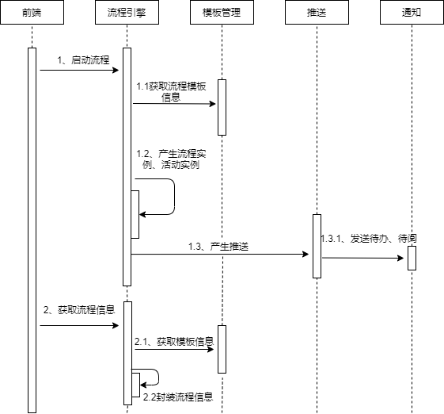
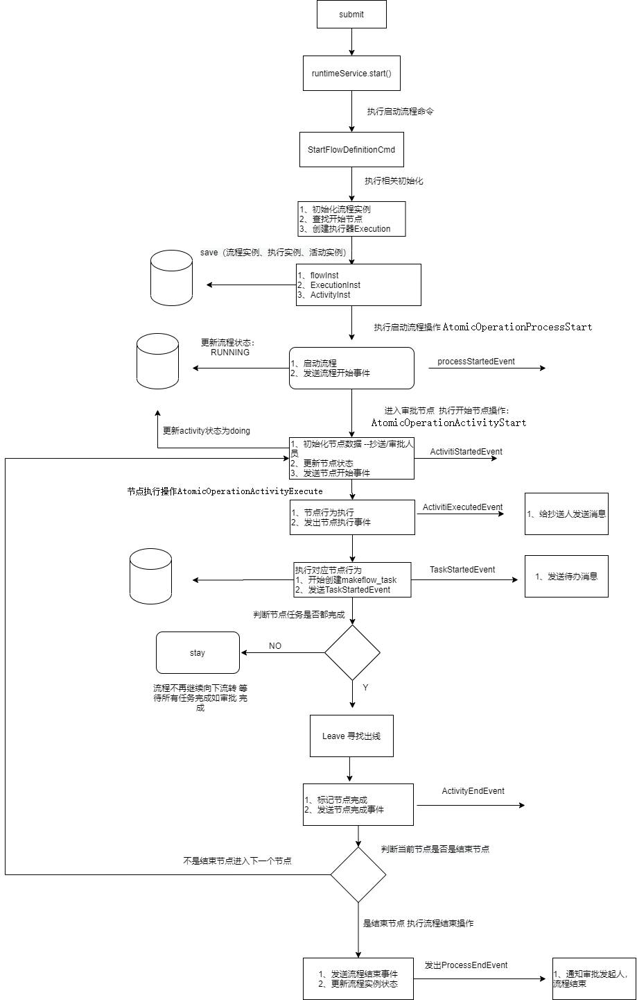

### 背景（问题）

​        目前使用的是activiti工作流作为流程引擎框架，目前有一下问题：

1. **水土不服**   
   * 主要是国内外对流程的认知和管控相差巨大，比如国外是没有回退一说的，但是国内甲方老大是不管这些的，单人办理、多人顺序、多人并行....国外压根没这些概念。
2. **扩展性和定制化复杂**：
   * 尽管Activiti提供了一些扩展点和API来自定义和扩展工作流引擎，但在处理复杂业务需求时，可能需要深入了解其内部架构和机制，这可能增加了开发和调试的复杂性
3. **内部问题不便于排查**：
4. **流程设计建模后的数据结构比较重( xml)**。
   * 需要做大量代码做标签及属性解析
5. **不支持非关系型数据库**：
   * 活动任务持久化后的数据量比较大，传统关系型数据库可能需要做分表分库等操作。

### 目标

* 自主研发直接支持国内相关审批需求
* 提供高度的扩展能力以及定制化能力
* 支持非关系型数据库
* 通过json来保存建模数据
* 为三方系统提供流程引擎能力

### 业务需求

支持：模板管理、流程设计建模、流程发起、会签、或签、委托、加签、回退、撤回

### 流程建模

模板管理 makeflow-template-service

自及定义相关的模型，标识出流程中的活动、决策点、并行和串行执行的步骤等。

并适配层兼容原有的流程建模

### 流程引擎

自主开发

##### 未来整体系统架构

**模板管理**：用于给流程引擎、布局、表单等功能设置模板配置等

**流程引擎**：流程运转

**表单渲染**：用于表单渲染

**通用配置**：针对不同场景做一些不同的配置

**文档生成导出**：用于耗时IO的任务处理

**推送**：统一推送，待办或其他系统信息同步等

**其他服务**：根据实际情况添加及和其他服务通讯

**平台能力**：提供链路追踪，日志收集、注册中心、配置中心等

# makeflow-service

>   打造国内最强工作流

* 可单独作为审批工作流中台服务
* 可打包到工程中做为审批工作流插件

### 工程模块介绍

如何拆分：

* 按业务功能（无状态） : 便于服务扩容，业务逻辑理解

* 按是否数据量大,长IO

* 数据库 : 此处将数据库操作单独提出来，防止以后对应模块作为服务的时候，集群数量限制于数据库本身连接数以及便于数据源类型的切换不影响原有逻辑。数据源切换适配等
  
  | 模块名                          | 描述                           |
  | ---------------------------- |:----------------------------:|
  | makeflow-form-api            | 表单服务的api，用于其他模块服或务***调用***   |
  | makeflow-form-data           | 表单服务单纯对***数据库***的操作          |
  | makeflow-form-servie         | 表单服务(核心***逻辑***)             |
  | makeflow-template-api        | 模板服务的api，用于其他模块或服务***调用***   |
  | makeflow-template-data       | 模板服务单纯对***数据库***的操作          |
  | makeflow-template-service    | 模板服务(核心***逻辑***)             |
  | makeflow-workflow-api        | 工作流引擎的api，用于其他模块或服务***调用***  |
  | makeflow-workflow-data       | 工作流引擎单纯对***数据库***的操作         |
  | makeflow-workflow-service    | 工作量引擎服务(核心***逻辑***)          |
  | makeflow-document-api        | 文档操作对的api,用于其他模块或服务***调用***  |
  | makeflow-document-service    | 文档操作(核心***逻辑***)             |
  | makeflow-push-service        | 相关事件***推送***，和三方系统***异步***交互 |
  | makeflow-basic-service       | 代码的相关***配置***或***约定***       |
  | makeflow-service-application | springboot启动的地方              |

>   约定：代码包名创建规则 com.makeid.makeflow.{{模块名}}.. 如com.makeid.makeflow.workflow.service

### 流程引擎架构

***定义层***：属于模板模块 用于定义相关流程元素

***业务层***：流程引擎操作入口，业务入口

***命令层***：所有的命令都会经过拦截器【日志、事务、分布式锁....】,将业务逻辑封装为一个个的Command接口实现类。这样新增一个业务功能时只需要新增一个Command实现即可。

***操作层***：整个流程引擎会有5个固定操作。启动流程、开始节点、执行节点逻辑、结束节点、节点流转（寻找下一个活动），其中流程运转的过程中会不断的执行【开始节点->执行节点逻辑->结束节点->节点流程->开始节点】

***行为执行层***：不同的节点都会有不同的行为。在操作层执行节点逻辑时会选择执行对应节点行为

***事件总线***：事件总线贯穿整个流程引擎用于发布订阅相关事件（流程创建事件，状态变化事件，节点初始化事件等等），实现业务拓展解耦等

### 启动流程时序图

### 启动流程流程图

### 如何结合现有业务

模板设计兼容

原先采用xml存储bpmn2.0的模型，通过原有activiti解析xml成对应模型 ，加入中间成转换成我们自己的数据模型

业务 兼容

通过监听器实现 

会针对每个节点 增加开发者选项配置

分别是执行时机【节点到达前、节点完成后、流程开始、流程结束】、 调用方式【通过接口获取spring中的bean列表进行调用，全限定包名,http，rpc】、同步/异步

流程监控 干预流程流传
